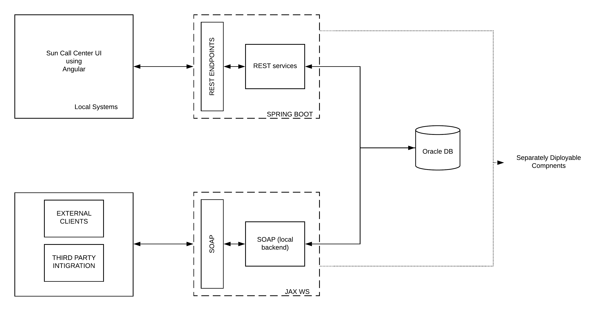
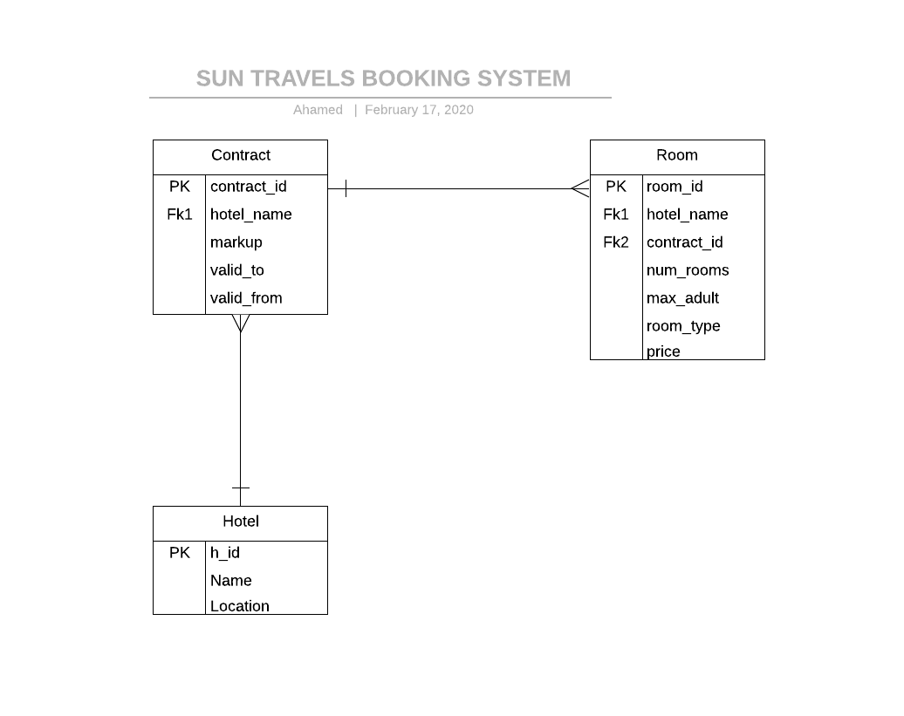
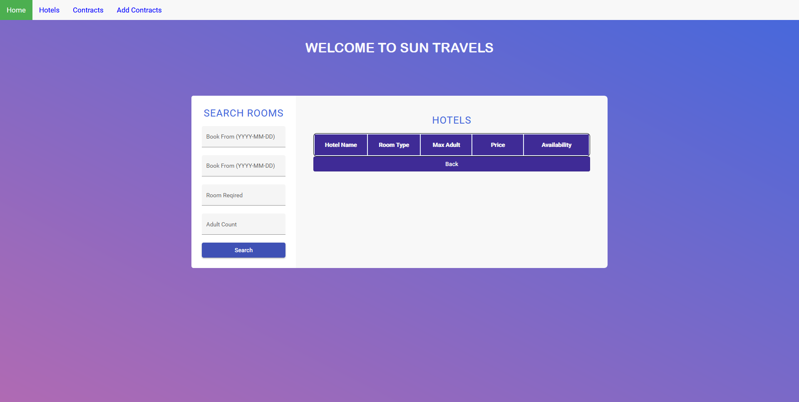
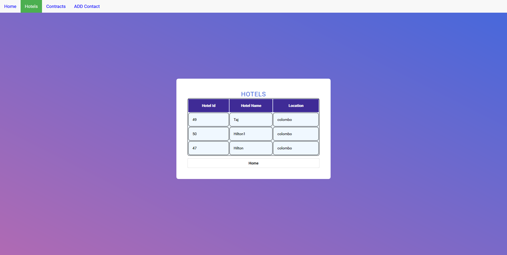
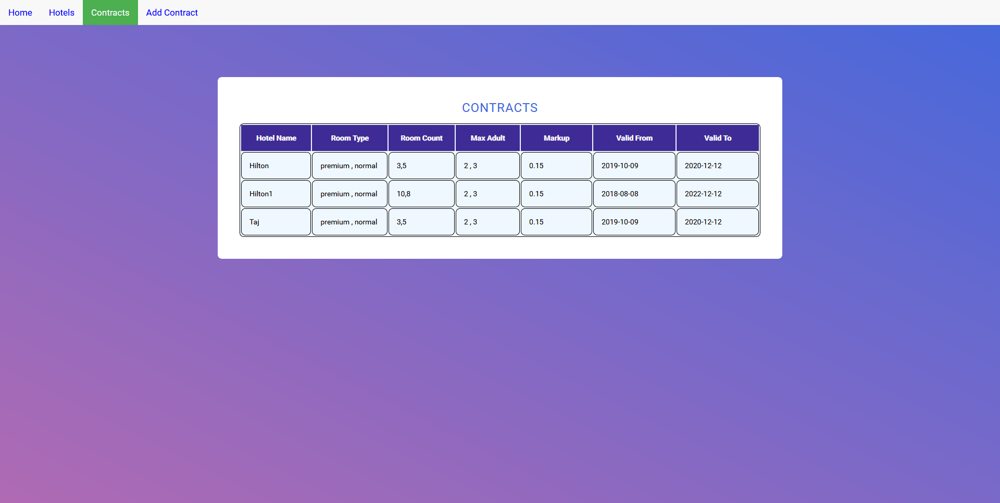
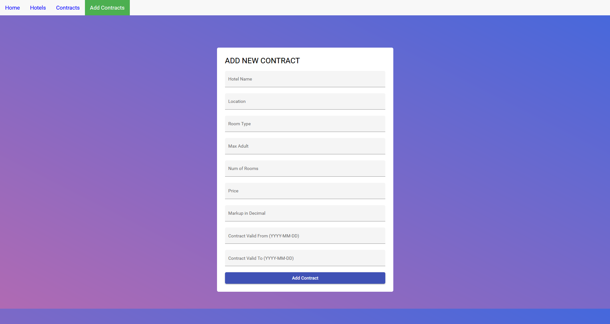

# SUN TRAVELS BOOKING SYSTEM

## ARCHITECTURE


## ENTITIY RELATION DIAGRAM


## FRONT END USING ANGULAR 8 : http://localhost:4200/
#### Search Screen

#### Hotels List Screen

#### Contract List Screen

#### Add New Contract Screen


## REST END POINTS
### GET REQUESTS
###### GET ALL HOTELS: http://localhost:8080/hotel
###### GET ALL CONTRACTS: http://localhost:8080/contract

### POST REQUESTS
###### ADD NEW CONTRECT: http://localhost:8080/contract
```json
{
"h_name"        : "Hilton Hotel",
"location"      : "Colombo",
"max_adult"     : "2 , 3",
"room_type"     : "premium , business",
"room_count"    : "10 , 8",
"price"         : "100.00 , 125.00",
"markup"        : 0.15,
"validFrom"     : "2015-05-05",
"validTo"       : "2020-10-10"
}
```
###### SEARCH FOR ROOMS: http://localhost:8080/rooms
```json
{
"bookFrom"  : "YYYY-MM-DD",
"bookTo"    : "YYYY-MM-DD",
"numRoom"   : 3,
"numAdult"  : 5
}
```

## SOAP END POINTS
#### GER ALL CONTRACT AND CREATE CONTRACT: http://localhost:9966/contract?wsdl
###### SOAP Request to get all contracts
```xml
<?xml version="1.0" encoding="UTF-8"?><S:Envelope xmlns:S="http://schemas.xmlsoap.org/soap/envelope/" xmlns:SOAP-ENV="http://schemas.xmlsoap.org/soap/envelope/">
    <SOAP-ENV:Header/>
    <S:Body xmlns:ns2="http://controller.sun.com/">
        <ns2:getContracts/>
    </S:Body>
</S:Envelope>
```
###### SOAP Response to get all contracts
```xml
<?xml version="1.0" encoding="UTF-8"?><S:Envelope xmlns:S="http://schemas.xmlsoap.org/soap/envelope/" xmlns:SOAP-ENV="http://schemas.xmlsoap.org/soap/envelope/">
    <SOAP-ENV:Header/>
    <S:Body xmlns:ns2="http://controller.sun.com/">
        <ns2:getContractsResponse xmlns:xs="http://www.w3.org/2001/XMLSchema" xmlns:xsi="http://www.w3.org/2001/XMLSchema-instance">
            <return xsi:type="xs:string">{"c_id":30,"markup":0.15,"validFrom":"2019-10-09","validTo":"2020-12-12","max_adult":"2 , 3","room_type":"premium , normal","room_count":"3,5","price":"100.00 , 50.00","hotels":47}</return>
            <return xsi:type="xs:string">{"c_id":31,"markup":0.15,"validFrom":"2019-10-09","validTo":"2020-12-12","max_adult":"2 , 3","room_type":"premium , normal","room_count":"3,5","price":"100.00 , 50.00","hotels":49}</return>
        </ns2:getContractsResponse>
    </S:Body>
</S:Envelope>
```
###### Metho Return Jason String list
```json
[{"c_id":30,"markup":0.15,"validFrom":"2019-10-09","validTo":"2020-12-12","max_adult":"2 , 3","room_type":"premium , normal","room_count":"3,5","price":"100.00 , 50.00","hotels":47}, 
{"c_id":31,"markup":0.15,"validFrom":"2019-10-09","validTo":"2020-12-12","max_adult":"2 , 3","room_type":"premium , normal","room_count":"3,5","price":"100.00 , 50.00","hotels":49}]
```
###### SOAP Request to add a Contract
```xml
<?xml version="1.0" encoding="UTF-8"?><S:Envelope xmlns:S="http://schemas.xmlsoap.org/soap/envelope/" xmlns:SOAP-ENV="http://schemas.xmlsoap.org/soap/envelope/">
    <SOAP-ENV:Header/>
    <S:Body xmlns:ns2="http://controller.sun.com/">
        <ns2:addContract>
            <arg0>Hilton1</arg0> <!Hotel Name>
            <arg1>colombo</arg1> <!Hotel Location>  
            <arg2>premium , normal</arg2> <!Room Types Separated by commas>
            <arg3>2 , 3</arg3> <!Maximum Adult per Room Separated by commas>
            <arg4>10,8</arg4>  <!Num of Rooms Separated by commas>
            <arg5>100.00 , 50.00</arg5> <!Price of Rooms per Adult Separated by commas>
            <arg6>0.15</arg6> <!Markup in Decimal 15% means 0.15>
            <arg7>2018-08-08</arg7> <!Contract Start Date YYYY-MM-DD Format>
            <arg8>2022-12-12</arg8> <!Contract Expire Date YYYY-MM-DD Format>
        </ns2:addContract>
    </S:Body>
</S:Envelope>
```

###### SOAP Resposne to add a Contract Metho Returns String True
```xml
<?xml version="1.0" encoding="UTF-8"?><S:Envelope xmlns:S="http://schemas.xmlsoap.org/soap/envelope/" xmlns:SOAP-ENV="http://schemas.xmlsoap.org/soap/envelope/">
    <SOAP-ENV:Header/>
    <S:Body xmlns:ns2="http://controller.sun.com/">
        <ns2:addContractResponse>
            <return>True</return>
        </ns2:addContractResponse>
    </S:Body>
</S:Envelope>
```
######  Metho Returns String True

#### GER ALL HOTEL: http://localhost:9966/hotel?wsdl
###### SOAP Request to get all Hotels
```xml
<?xml version="1.0" encoding="UTF-8"?><S:Envelope xmlns:S="http://schemas.xmlsoap.org/soap/envelope/" xmlns:SOAP-ENV="http://schemas.xmlsoap.org/soap/envelope/">
    <SOAP-ENV:Header/>
    <S:Body xmlns:ns2="http://controller.sun.com/">
        <ns2:getHotels/>
    </S:Body>
</S:Envelope>
```
###### Example Resoponse
```xml
<?xml version="1.0" encoding="UTF-8"?><S:Envelope xmlns:S="http://schemas.xmlsoap.org/soap/envelope/" xmlns:SOAP-ENV="http://schemas.xmlsoap.org/soap/envelope/">
    <SOAP-ENV:Header/>
    <S:Body xmlns:ns2="http://controller.sun.com/">
        <ns2:getHotelsResponse xmlns:xs="http://www.w3.org/2001/XMLSchema" xmlns:xsi="http://www.w3.org/2001/XMLSchema-instance">
            <return xsi:type="xs:string">{"h_id":49,"h_name":"Taj","location":"colombo"}</return>
            <return xsi:type="xs:string">{"h_id":47,"h_name":"Hilton","location":"colombo"}</return>
        </ns2:getHotelsResponse>
    </S:Body>
</S:Envelope>
```
#### SEARCH FOR ROOMS: http://localhost:9966/rooms?wsdl
###### SOAP Request to Search Rooms
```xml
    <?xml version="1.0" encoding="UTF-8"?><S:Envelope xmlns:S="http://schemas.xmlsoap.org/soap/envelope/" xmlns:SOAP-ENV="http://schemas.xmlsoap.org/soap/envelope/">
        <SOAP-ENV:Header/>
        <S:Body xmlns:ns2="http://controller.sun.com/">
            <ns2:searchRoom>
                <arg0>2020-02-02</arg0> <!FROMDATE FORMAT YYYY-MM-DD>
                <arg1>2020-02-10</arg1> <!TODATE FORMAT YYYY-MM-DD>
                <arg2>1</arg2> <!Num of Rooms>
                <arg3>2</arg3> <!Num of Adults>
            </ns2:searchRoom>
        </S:Body>
    </S:Envelope>
```
###### SOAP Response to Search Rooms
```xml
<?xml version="1.0" encoding="UTF-8"?><S:Envelope xmlns:S="http://schemas.xmlsoap.org/soap/envelope/" xmlns:SOAP-ENV="http://schemas.xmlsoap.org/soap/envelope/">
    <SOAP-ENV:Header/>
    <S:Body xmlns:ns2="http://controller.sun.com/">
        <ns2:searchRoomResponse xmlns:xs="http://www.w3.org/2001/XMLSchema" xmlns:xsi="http://www.w3.org/2001/XMLSchema-instance">
            <return xsi:type="xs:string">{"h_name":"Hilton","room_Type":"premium","max_adult":2,"price":230.0}</return>
            <return xsi:type="xs:string">{"h_name":"Hilton","room_Type":"normal","max_adult":3,"price":115.0}</return>
            <return xsi:type="xs:string">{"h_name":"Taj","room_Type":"premium","max_adult":2,"price":230.0}</return>
            <return xsi:type="xs:string">{"h_name":"Taj","room_Type":"normal","max_adult":3,"price":115.0}</return>
        </ns2:searchRoomResponse>
    </S:Body>
</S:Envelope>
```
###### Metho Return Jason String list
```json
[{"h_name":"Hilton","room_Type":"premium","max_adult":2,"price":230.0}, 
{"h_name":"Hilton","room_Type":"normal","max_adult":3,"price":115.0}, 
{"h_name":"Taj","room_Type":"premium","max_adult":2,"price":230.0}, 
{"h_name":"Taj","room_Type":"normal","max_adult":3,"price":115.0}]
```
